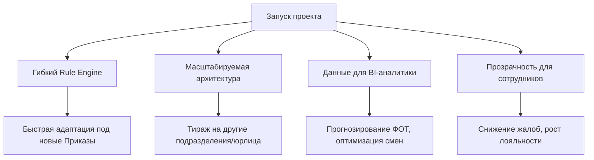

---

# ПРОЕКТ: Автоматизация расчёта заработной платы сотрудников обособленных подразделений ГК «СКС»

---

## 📑 Содержание

1. [Общая информация](#-1-общая-информация)
2. [Проблема и целевое состояние](#-2-проблема-и-целевое-состояние)
   - 2.1. [Причины проблемы (глубинный анализ)](#-21-причины-проблемы-глубинный-анализ)
3. [Цель проекта (SMART)](#-3-цель-проекта-smart)
   - 3.1. [Варианты решений](#️-31-варианты-решений-кратко)
   - 3.2. [Обоснование выбора](#-32-обоснование-выбора)
4. [Содержание проекта и этапы](#-4-содержание-проекта-и-этапы)
5. [Методология и график (Agile/Waterfall)](#-5-методология-и-график-agilewaterfall)
6. [Команда и распределение ролей (RACI)](#-6-команда-и-распределение-ролей-raci)
   - 6.1. [Ресурсы проекта](#-61-ресурсы-проекта)
7. [Бюджет и экономическая эффективность](#-7-бюджет-и-экономическая-эффективность)
8. [Управление рисками](#️-8-управление-рисками)
9. [Стейкхолдеры и коммуникация](#-9-стейкхолдеры-и-коммуникация)
10. [Техническая архитектура и стек](#️-10-техническая-архитектура-и-стек)
11. [Критерии успеха и завершение](#-11-критерии-успеха-и-завершение)
12. [Долгосрочная ценность и тиражируемость](#-12-долгосрочная-ценность-и-тиражируемость)
13. [Дополнительные аргументы](#-13-дополнительные-аргументы)

---

## 📊 1. Общая информация

| Параметр | Значение |
|----------|----------|
| **Наименование** | Автоматизация расчёта ЗП сотрудников ОП ГК «СКС» |
| **Спонсор** | Руководитель ГК «СКС» |
| **Руководитель проекта** | Аналитик |
| **Срок реализации** | 05.05.2026 – 01.09.2026 (17 недель) |
| **Методология** | Гибридная (Agile/Scrum для исполнения, Waterfall/Гант для отчётности) |
| **Бюджет** | ~827 640 руб. (внутренние затраты на ФОТ команды) |
| **Ожидаемый эффект** | Экономия ~60 000 руб./мес (720 000 руб./год), сокращение времени расчёта с 3–5 дней до ≤2 часов, 0% ошибок, 100% соответствие Приказу № СКС-03 |

---

## 🎯 2. Проблема и целевое состояние

### Текущая ситуация
- Расчёт ЗП ~200 сотрудников ведётся финансистом вручную в Excel
- Смены в учётной системе (АРМ) привязаны к **юридическому лицу**, а не к **должности**, что вызывает задвоение баллов при работе в разных организациях
- Процесс занимает **3–5 рабочих дней/мес**
- Высокий риск ошибок при расчёте десятков коэффициентов
- Нет прозрачности для сотрудников
- Смежные сотрудники (руководители ОП) тратят время на согласование табелей, исправление ошибок и ручную сверку данных

### Желаемая ситуация
- Единая система учёта смен, привязанная к **должности**
- Автоматический **Rule Engine** рассчитывает оклад, премии, надбавки и МГВ строго по Приказу СКС-03
- Финансист тратит на проверку и запуск **~2 часа**
- Сотрудники видят детализацию в личном кабинете
- Данные консолидированы по территориальным образованиям (ТО), задвоения исключены
- Смежные сотрудники и руководители получают готовые отчёты без ручной обработки

### Оцифрованный разрыв

| Показатель | Эффект |
|---|---|
| Время расчёта финансиста | −40 часов ФОТ/мес + высвобождение времени смежных сотрудников |
| Ошибки расчёта | снижение до 0% |
| Прозрачность для сотрудников | +100% (детализация в ЛК) |
| Операционная нагрузка | снятие с ФЭО и смежных подразделений |

---

## 🔍 2.1. Причины проблемы (Глубинный анализ)
> *«Вы показали, что копнули глубже, чем просто симптом»*

| Уровень | Корневая причина | Влияние на бизнес |
|---------|------------------|-------------------|
| **Технический** | В АРМ смены привязаны к **Юридическому Лицу**, а не к **Должности** | Дублирование баллов при работе в нескольких юрлицах, ломается математическая модель расчёта |
| **Процессный** | Использование **Excel** как системы учёта | Отсутствие версионности, ручные переносы данных, невозможность автоматизации и аудита изменений |
| **Нормативный** | Приказ СКС-03 содержит **динамические коэффициенты** и исключения | В таблицах невозможно поддерживать актуальность 20+ условий без риска человеческого фактора при каждом обновлении |

---

## 🎯 3. Цель проекта (SMART)

> Запустить в АРМ ГК «СКС» автоматизированный расчёт ЗП по **100% формулам Приказа СКС-03** к **01.09.2026**, сократив время расчёта с **3–5 дней до ≤2 часов**, обеспечив **0% расхождений** с ручным расчётом и загрузив личный кабинет детализации для **100% сотрудников**.

| Критерий | Расшифровка |
|----------|-------------|
| **S**pecific (Конкретная) | Автоматизация расчёта ЗП по формулам Приказа СКС-03 |
| **M**easurable (Измеримая) | Время ≤2 ч, расхождение 0%, покрытие 100% формул |
| **A**chievable (Достижимая) | Реализуется штатной командой в рамках ФОТ |
| **R**elevant (Актуальная) | Соответствует стратегии цифровизации ФЭО |
| **T**ime-bound (Ограниченная по времени) | Запуск до 01.09.2026 |

---

## 🛠️ 3.1. Варианты решений (кратко)
> *«Вы честны — есть альтернативы, а не только ваш путь»*

| Вариант | Описание | Плюсы | Минусы | Статус |
|---------|----------|-------|--------|--------|
| **1. Статус-кво** | Продолжить ручной расчёт в Excel | • 0 прямых затрат<br>• Привычный процесс | • ❌ 3–5 дней ФОТ/мес<br>• ❌ Высокий риск ошибок<br>• ❌ Нет прозрачности | ❌ Отклонён |
| **2. Коробочная система** | Внедрение 1С:ЗУП / HR-платформа | • • Готовый функционал ЗП | • 💰 ~2.5–3 млн руб. лицензии<br>• ⏳ 6–12 мес. внедрения<br>• ⚠️ Сложная доработка под Приказ СКС-03 | ❌ Отклонён (дорого/долго) |
| **3. Excel + VBA макросы** | Автоматизация текущих таблиц | • ⚡ Быстро<br>• 💰 Дёшево | • ⚠️ Не решает проблему дублей<br>• ❌ Нет интеграции с АРМ<br>• ❌ Не масштабируется | ❌ Отклонён (полумера) |
| **4. Rule Engine в АРМ** | **Разработка внутри текущей системы** | • 🎯 Идеально под Приказ СКС-03<br>• ⚡ 4 мес. срок<br>• 💰 Внутренние ресурсы | • ⚠️ Требует поддержки штатным РАЗРАБОТЧИКОМ | ✅ **ВЫБРАН** |

---

## ✅ 3.2. Обоснование выбора
> *«Почему мы идём именно этим путём, а не другим»*

Мы выбираем **Вариант 4 (Rule Engine в АРМ)** по следующим критериям:

1.  **Экономическая эффективность:** 
    - *Коробочное решение:* ~3 500 000 руб. (лицензии + внедрение) за 1-й год.
    - *Наше решение:* 827 640 руб. (виртуальные затраты ФОТ). **Экономия: ~4.2 раза.**
2.  **Скорость реализации:** Запуск за 4 месяца (до 01.09.2026) против 6–12 месяцев при внедрении сторонних ERP/HR-систем.
3.  **Точное соответствие бизнес-процессам:** Приказ СКС-03 имеет уникальную структуру коэффициентов. Rule Engine создаётся **специально под наши формулы**, исключая доработки коробочного ПО.
4.  **Использование текущей инфраструктуры:** Не требуются новые серверы, лицензии или переобучение сотрудников на новую платформу. Интеграция «из коробки».
5.  **Гибкость:** Конфигурируемые справочники позволяют изменять правила расчёта за часы, а не недели, без привлечения разработчиков.

---

## 📦 4. Содержание проекта и этапы

Проект включает **5 функциональных блоков**:


| Блок | Содержание | Результат | **A** (Accountable) |
|------|-----------|-----------|---------------------|
| **Блок 0** | Единый табель смен + справочник должностей | Привязка смены к должности, исключение задвоения баллов | Аналитик |
| **Блок 1** | SQL-витрины данных | План/факт по ТО, корректный учёт баллов | Разработчик |
| **Блок 2** | Rule Engine | Расчёт оклада, Нвл, Крт, Па, Пв, Кн, МГВ, 13-я ЗП, доплат | Разработчик |
| **Блок 3** | Веб-интерфейс для ФЭО + ЛК сотрудника | Удобный запуск расчёта, детализация ЗП для сотрудников | Аналитик |
| **Блок 4** | Параллельное тестирование, обучение, акт сверки, запуск | Подписанный акт, обученная команда, работающая система | Руководитель ФЭО |

---

## 🔄 5. Методология и график (Agile/Waterfall)

### Исполнение по Scrum: 8 спринтов по 2 недели

| Спринт | Период | Ключевые задачи | Результат | **A** (Accountable) |
|--------|--------|----------------|-----------|---------------------|
| **С-1** | 05.05–18.05 | Утверждение ТЗ, проектирование табеля и справочника | Готовое ТЗ, структура БД | Аналитик |
| **С-2** | 19.05–01.06 | SQL-витрины план/факт и баллов | Рабочие запросы для аналитики | Разработчик |
| **С-3** | 02.06–15.06 | Rule Engine: оклад, Нвл, Крт | Базовая логика расчёта оклада | Разработчик |
| **С-4** | 16.06–29.06 | Rule Engine: Посн, ПсЗ, Кн (с мех/антиквариат) | Премии с учётом новых категорий | Разработчик |
| **С-5** | 30.06–13.07 | Rule Engine: МГВ, 13-я ЗП, Пав + UI v1 | Полная формула ЗП + интерфейс | Разработчик |
| **С-6** | 14.07–01.08 | Полное тестирование (100% формул), внутренняя валидация | Протокол тестирования | Финансист |
| **С-7** | 04.08–22.08 | Исправление дефектов, личный кабинет, нагрузочный тест | Готовый ЛК, стабильная система | Разработчик |
| **С-8** | 25.08–01.09 | Обучение ФЭО, документирование, запуск в prod | Промышленная эксплуатация | Руководитель ФЭО |

### Ключевые вехи (Waterfall-представление)
| Дата | Веха | Ответственный (A) |
|---|---|---|
| 26.05.2026 | Утверждённое ТЗ | Аналитик |
| 16.06.2026 | Единый табель + SQL-витрины | Разработчик |
| 01.08.2026 | Rule Engine в АРМ (все формулы) | Разработчик |
| 26.08.2026 | Акт сверки подписан | Финансист |
| 01.09.2026 | 🚀 Промышленный запуск | Руководитель ФЭО |

---

## 👥 6. Команда и распределение ролей (RACI)

> **Легенда:** R = Responsible (исполняет), **A = Accountable (утверждает/несёт финальную ответственность — только один на задачу)**, C = Consulted (консультирует), I = Informed (информируется)

| Роль | Функция в проекте | Ключевые зоны RACI |
|------|------------------|-------------------|
| **Аналитик** (РП/Scrum Master) | Сбор требований, планирование, коммуникация, координация | **A** — ТЗ, план проекта, отчётность по тестированию; **R** — сбор требований, коммуникация; **C** — валидация формул; **I** — релиз |
| **Разработчик** (TechLead) | Разработка, интеграция, техническая документация | **A** — качество кода и техническая реализация; **R** — написание кода, интеграция; **C** — проектирование БД; **I** — утверждение ТЗ |
| **Финансист** (Валидатор) | Проверка формул, тестирование, обучение | **A** — корректность бизнес-логики и акт сверки; **R** — валидация расчётов, тестирование; **C** — проектирование формул; **I** — запуск в prod |
| **Руководитель ФЭО** (PO) | Приоритизация, финальная приёмка продукта | **A** — бизнес-ценность и финальный релиз (Go/No-Go); **C** — планирование, приоритизация бэклога; **I** — ход спринтов |

### Пример распределения «одного A» на ключевые артефакты:
| Артефакт / Процесс | **A** (единственный) | **R** (исполнители) | **C** | **I** |
|-------------------|---------------------|-------------------|-------|-------|
| Техническое задание | Аналитик | Аналитик | Разработчик, Финансист | Руководитель ФЭО |
| Структура БД / витрины | Разработчик | Разработчик | Аналитик | Финансист |
| Логика Rule Engine | Разработчик | Разработчик | Финансист, Аналитик | Руководитель ФЭО |
| Акт сверки расчётов | Финансист | Финансист | Аналитик, Разработчик | Руководитель ФЭО |
| Финальный релиз в prod | Руководитель ФЭО | Разработчик | Аналитик, Финансист | Спонсор |

---

## 👥 6.1. Ресурсы проекта
> *«Что нужно (люди, деньги, техника)»*

### 6.1.1. Человеческие ресурсы
| Роль | Кол-во | Занятость | Период | Ключевые компетенции |
|------|--------|-----------|--------|---------------------|
| **Аналитик** (РП) | 1 | 100% | 4 мес. | • Управление проектами<br>• Бизнес-анализ<br>• Scrum Master |
| **Разработчик** (TechLead) | 1 | 60% → 30% | 3.5 мес. | • C#, T-SQL<br>• Архитектура АРМ<br>• Интеграции |
| **Финансист** (Валидатор) | 1 | 15–20% | 3 мес. | • Расчёт ЗП<br>• Приказ СКС-03<br>• Тестирование |
| **Руководитель ФЭО** (PO) | 1 | 5–10% | 4 мес. | • Приоритизация<br>• Приёмка<br>• Бизнес-архитектура |

### 6.1.2. Технические ресурсы
| Ресурс | Описание | Статус |
|--------|----------|--------|
| **СУБД** | SQL Server (существующая) | ✅ Доступна |
| **Среда разработки** | Visual Studio / SSMS | ✅ Лицензии есть |
| **Sandbox АРМ** | Тестовый контур для разработки | ✅ Выделен |
| **Серверы** | Существующая инфраструктура | ✅ Достаточно ресурсов |
| **Инструменты** | Postman, Git, документация | ✅ Открытое ПО |

### 6.1.3. Временные ресурсы
| Параметр | Значение |
|---|---|
| Общая продолжительность | 17 недель (05.05.2026 – 01.09.2026) |
| Буфер времени | 3 дня на спринт (~10% от общего времени) на непредвиденные дефекты |

---

## 💰 7. Бюджет и экономическая эффективность

### Расчёт реальных затрат на основе ФОТ команды

| Роль | ФОТ/мес | Занятость | Период | Стоимость часа | Итого затрат |
|------|---------|-----------|--------|---------------|--------------|
| **Аналитик** | 100 000 руб. | 100% | 4 мес. | ~625 руб./ч | **~350 000 руб.** |
| **Разработчик** | 200 000 руб. | 60% → 30% | 3.5 мес. | ~1 250 руб./ч | **~360 000 руб.** |
| **Финансист** | 100 000 руб. | 15–20% | 3 мес. | ~625 руб./ч | **~65 000 руб.** |
| **Руководитель ФЭО** | 150 000 руб. | 5–10% | 4 мес. | ~940 руб./ч | **~52 640 руб.** |
| **ВСЕГО** | | | | | **~827 640 руб.** |

### Распределение затрат по спринтам

| Период | Спринты | Затраты (руб.) | Ключевые активности |
|--------|---------|----------------|---------------------|
| Май 2026 | С-1, С-2 | ~235 040 | Проектирование, ТЗ |
| Июнь–Июль 2026 | С-3, С-4, С-5 | ~397 560 | Разработка Rule Engine |
| Август 2026 | С-6, С-7, С-8 | ~195 040 | Тестирование, внедрение |
| **Итого** | **8 спринтов** | **~827 640** | **Полный цикл разработки** |

### Экономический эффект (выгоды)

| Параметр расчёта | Значение |
|---|---|
| Текущие затраты на ручной расчёт | ~40 часов/мес × ~1 500 руб/ч = ~60 000 руб/мес |
| После автоматизации | ~2 часа/мес |
| **Экономия** | **~60 000 руб./мес = 720 000 руб./год** |

Дополнительно (качественные эффекты): высвобождение времени смежных сотрудников (руководители ОП) и снижение операционных рисков и ошибок.

### Финансовые показатели (с учётом внутренних затрат)

| Показатель | Формула | Значение | Интерпретация |
|------------|---------|----------|---------------|
| **Инвестиции (I₀)** | Сумма ФОТ команды | **827 640 руб.** | Реальная стоимость разработки |
| **Ежемесячная экономия (CF)** | Разница «было/стало» | **60 000 руб./мес** | Начинается с сентября 2026 |
| **Точка безубыточности** | Нет внешних выплат | **По внешним деньгам — мгновенно** | Проект не требует внешнего финансирования; возврат внутренних инвестиций ФОТ — см. срок окупаемости ниже |
| **Срок окупаемости (PP)** | `827 640 / 60 000` | **~13.8 месяцев** | Окупится к октябрю 2027 |
| **DPP (10%)** | Дисконтированный поток | **~15 месяцев** | С учётом стоимости денег |
| **ROI (3 года)** | `(2 160 000 − 827 640) / 827 640` | **~161%** | Высокая отдача на внутренние инвестиции |
| **NPV (3 года, 10%)** | `Σ [CFt / (1+r)^t] − I₀` | **~+450 000 руб.** | Проект создаёт добавленную стоимость |
| **PI** | `PV поступлений / Инвестиции` | **~1.54** | На 1 руб. вложений — 1.54 руб. дохода |

### Денежные потоки (прогноз с учётом затрат)

| Период | Затраты (руб.) | Экономия (руб.) | Чистый поток | Накопительный итог |
|--------|---------------|-----------------|--------------|-------------------|
| Май 2026 | ~235 040 | 0 | −235 040 | −235 040 |
| Июнь 2026 | ~198 780 | 0 | −198 780 | −433 820 |
| Июль 2026 | ~198 780 | 0 | −198 780 | −632 600 |
| Август 2026 | ~195 040 | 0 | −195 040 | −827 640 |
| Сентябрь 2026 | 0 | +60 000 | +60 000 | −767 640 |
| Октябрь 2026 | 0 | +60 000 | +60 000 | −707 640 |
| ... | ... | ... | ... | ... |
| Октябрь 2027 | 0 | +60 000 | +60 000 | **~0 (окупаемость)** |
| Декабрь 2028 | 0 | +60 000 | +60 000 | **+450 000 (NPV)** |

> ✅ **Кассовые разрывы отсутствуют** — все затраты покрываются штатным ФОТ, внешних выплат не требуется.

---

## ⚠️ 8. Управление рисками

| ID | Риск | Вер. / Влияние | Стратегия | Триггер | Ответственный |
|----|------|---------------|-----------|---------|--------------|
| **R-01** | Недоступность ключевого разработчика | 3 / 5 | **Смягчение**: резерв 60% времени, буфер 3 дн/спринт, документирование кода | Отсутствие >1 раб. дня без предупреждения | Аналитик (РП) |
| **R-02** | Ошибки в формулах/ТЗ | 4 / 4 | **Смягчение**: итеративная валидация с финансистом, эталонные таблицы для автотестов | Расхождение в тестовом расчёте >1% | Аналитик |
| **R-03** | «Грязные данные» в АРМ | 3 / 4 | **Снижение**: процедура очистки, логирование, валидация при загрузке | Расхождение план/факт по ТО >10% | Разработчик |
| **R-04** | Расхождение при параллельном расчёте | 3 / 5 | **Снижение**: обязательная сверка, стоп-запуск при расхождении >1% | Разница итоговых сумм >1% | Финансист |
| **R-05** | Изменение Приказа СКС-03 | 2 / 4 | **Принятие + Снижение**: гибкий Rule Engine, конфигурируемые справочники | Подписан новый приказ | Аналитик |

### Матрица рисков

| Вероятность ↓ \ Влияние → | Незначительное | Умеренное | Критическое | Катастрофическое |
|---|---|---|---|---|
| **Очень высокая** | — | — | — | — |
| **Высокая (4)** | — | — | R-02 | — |
| **Средняя (3)** | — | — | R-03, R-04 | R-01 |
| **Низкая (2)** | — | — | — | R-05 |

---

## 🤝 9. Стейкхолдеры и коммуникация

| Стейкхолдер | Влияние | Заинтересованность | Стратегия | Формат взаимодействия |
|-------------|---------|-------------------|-----------|----------------------|
| **Спонсор / Руководитель ГК** | Высокое | Высокая | ✅ Удовлетворяй | Ежемесячные краткие отчёты по вехам и экономии |
| **Руководитель ФЭО (PO)** | Высокое | Высокая | 🤝 Тесное взаимодействие | Еженедельные Sprint Review, приоритизация бэклога |
| **Финансист / Валидатор** | Среднее | Высокая | 🤝 Партнёрство | Еженедельная валидация, совместное тестирование |
| **Разработчик** | Высокое | Средняя | 🤝 Тесное взаимодействие | Daily Scrum, чёткие задачи на спринт |
| **Сотрудники ОП (~200)** | Низкое | Высокая | ℹ️ Информируй | Анонс ЛК, инструкции, сбор фидбэка |

### Матрица стейкхолдеров

| Влияние ↓ \ Заинтересованность → | Низкая | Высокая |
|---|---|---|
| **Высокое** | **Удовлетворяй** — Спонсор | **Тесное взаимодействие** — Руководитель ФЭО |
| **Низкое** | **Наблюдай** — смежные отделы | **Информируй** — сотрудники ОП |

---

## 🛠️ 10. Техническая архитектура и стек

### Технологический стек
```yaml
СУБД:
  - SQL Server (существующая)

Разработка:
  - C# (интеграция в АРМ)
  - T-SQL (витрины данных, Rule Engine)

Инструменты:
  - Visual Studio / VS Code
  - SQL Server Management Studio (SSMS)
  - Postman (API-тестирование)
  - Sandbox-среда АРМ (тестирование)

Архитектура:
  ┌─────────────────────────────────┐
  │ Слой представления               │
  │ • Веб-интерфейс для ФЭО         │
  │ • Личный кабинет сотрудника     │
  ├─────────────────────────────────┤
  │ Слой бизнес-логики (Rule Engine)│
  │ • Конфигурируемые справочники   │
  │ • Динамические формулы Приказа  │
  ├─────────────────────────────────┤
  │ Слой данных (SQL-витрины)       │
  │ • План/факт по ТО               │
  │ • Учёт баллов без задвоения     │
  └─────────────────────────────────┘
```

### Безопасность и надёжность
- ✅ Ролевая модель доступа (ФЭО, разработчик, сотрудник)
- ✅ Аудит изменений формул и справочников
- ✅ Логирование всех расчётов для отладки
- ✅ План отката при критических ошибках
- ✅ Резервное копирование БД перед релизом

---

## ✅ 11. Критерии успеха и завершение

Проект считается **успешным** при выполнении **всех** условий:

| ✔ | Критерий успеха | Условие | Ответственный (A) |
|---|---|---|---|
| ☐ | Запуск в prod | до 01.09.2026 без задержек | Руководитель ФЭО |
| ☐ | Акт сверки расчётов за тестовый месяц | расхождение 0% | Финансист |
| ☐ | Время расчёта | ≤2 часов (было 3–5 дней) | Финансист |
| ☐ | Доступ сотрудников к детализации в ЛК | предоставлен | Аналитик |
| ☐ | Критические инциденты в первые 30 дней | отсутствуют | Разработчик |

### Чек-лист закрытия проекта

| ✔ | Действие | Ответственный (A) |
|---|---|---|
| ☐ | Акт приёмки-передачи подписан | Руководитель ФЭО |
| ☐ | Документация передана в ФЭО и ОРПО | Аналитик |
| ☐ | Обучение сотрудников проведено (протокол) | Финансист |
| ☐ | Резервная копия «до» и «после» создана | Разработчик |
| ☐ | Ретроспектива проекта проведена | Аналитик |
| ☐ | Извлечённые уроки зафиксированы | Аналитик |

---

## 🚀 12. Долгосрочная ценность и тиражируемость

### Преимущества после запуска


### Стратегические выгоды
| Выгода | Описание | Эффект | **A** (ответственный за реализацию) |
|--------|----------|--------|-------------------------------------|
| **Тиражируемость** | Rule Engine настраивается без кода | Быстрый запуск в новых ОП/юрлицах | Разработчик |
| **Гибкость** | Справочники и формулы — конфигурация, не код | Адаптация к изменениям Приказа за часы, не недели | Разработчик |
| **Аналитика** | Структурированные данные по ЗП, баллам, ТО | Основа для BI-дашбордов и прогнозных моделей | Аналитик |
| **Лояльность** | Прозрачный ЛК с детализацией ЗП | Снижение нагрузки на HR, рост доверия сотрудников | Аналитик |
| **Стандартизация** | Единый процесс вместо «ручных» Excel | Снижение операционных рисков, масштабируемость | Руководитель ФЭО |

---

## 💎 13. Дополнительные аргументы
> *«Почему это выгоднее, чем кажется»*

Помимо прямой финансовой экономии (720 тыс. руб./год), проект даёт скрытые стратегические преимущества:

1.  **Снижение скрытых издержек:** Экономия 38–46 часов ФОТ смежных сотрудников (руководители ОП, HR) на согласования и исправления ошибок. Это высвобождает ~4 140 руб./мес дополнительно.
2.  **Юридическая защита:** 100% соответствие Приказу СКС-03 зафиксировано в коде и логах. При аудите или трудовом споре у компании есть цифровая история расчётов, а не «потерянные» Excel-файлы.
3.  **Данные для управленческих решений:** Структурированные витрины позволяют мгновенно получать срезы: «ФОТ по регионам», «Нагрузка по должностям», «Прогноз 13-й ЗП». Основа для Data-Driven управления.
4.  **Репутация работодателя:** Прозрачный личный кабинет с детализацией каждой надбавки снижает уровень стресса персонала и количество запросов в бухгалтерию на 80–90%.
5.  **Нулевой кассовый разрыв:** Проект финансируется исключительно за счёт перераспределения времени штатных сотрудников. Денежные потоки компании не затрагиваются.

---

> 💡 **Ключевой вывод**: Проект требует внутренних инвестиций ~827 640 руб. (ФОТ команды), но генерирует измеримую экономию с первого месяца эксплуатации. Срок окупаемости ~14 месяцев, ROI ~161% за 3 года. Гибкая архитектура и конфигурируемый Rule Engine обеспечивают долгосрочную устойчивость решения к изменениям в системе мотивации.
